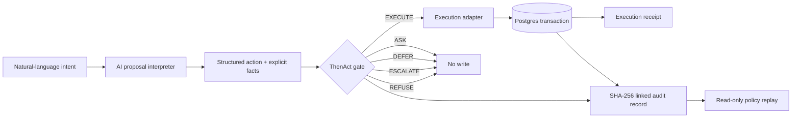

# ThenAct Architecture

## Core principle

**Confidence is evidence. Never authority.**

ThenAct deliberately separates a learned proposer from a deterministic permission layer.

## AI proposal interpreter

Agent Mode uses AI SDK structured output to propose:

- domain
- action
- explicitly supported context/evidence
- proposal confidence
- rationale
- source facts
- uncertainty warnings

The proposer is **not an authority source**. It preserves unknowns instead of inventing them.

## Deterministic authorization

Policy order:

1. Hard policy
2. Evidence freshness
3. Missing information
4. Authority
5. Risk + reversibility
6. Confidence

Confidence is evaluated last and cannot override a failed authority or hard-policy check.

## Enforcement transaction

For `EXECUTE`, ThenAct opens a Postgres transaction, acquires a short advisory lock for audit-chain serialization, inserts the sandbox execution receipt, computes the next linked audit hash, inserts the audit record, and commits.

If any step fails, the transaction rolls back. This prevents an execution receipt from existing without its corresponding audit record.

All non-EXECUTE outcomes skip receipt creation and persist the prevented enforcement result.

## Audit integrity

Every record contains:

- input context
- decision signals
- policy trace
- reason codes
- policy version
- enforcement result
- previous record hash
- SHA-256 record hash

The Audit Ledger recomputes each visible hash and checks links between adjacent records.

## Replay

Historical inputs can be evaluated against the current policy version. Replay is read-only and never calls the execution transaction.
