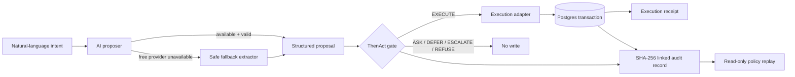

# ThenAct Architecture

## Core principle

**Confidence is evidence. Never authority.**

ThenAct separates probabilistic interpretation from deterministic permission.

## Proposal layer

Agent Mode first attempts external free-model inference through OpenRouter. Model output is normalized and validated before it becomes a proposal.

If shared free capacity is unavailable, a deliberately narrow local extractor recognizes only the three supported demo domains and explicit facts. The UI identifies this as **SAFE FALLBACK**. It cannot approve an action and never bypasses ThenAct.

## Deterministic authorization

Policy order:

1. Hard policy
2. Evidence freshness
3. Missing information
4. Authority
5. Risk + reversibility
6. Confidence

Confidence is evaluated last. It cannot override a failed authority or hard-policy check.

## Enforcement transaction

For `EXECUTE`, ThenAct opens a Postgres transaction, acquires an advisory lock, creates the sandbox execution receipt, computes the next audit hash, inserts the audit record, then commits.

If any step fails, the transaction rolls back. Non-EXECUTE outcomes create no execution receipt.

## Audit integrity

Every record contains the input, signals, decision, reason codes, policy trace, policy version, enforcement result, previous record hash and record hash.

Hashing uses recursively canonicalized JSON so Postgres JSONB key ordering cannot alter verification. Chain-head selection is based on hash links rather than timestamps, preventing same-second writes from forking the ledger.

## Replay

Historical input can be evaluated under the current policy version. Replay is read-only and never invokes the execution adapter.
