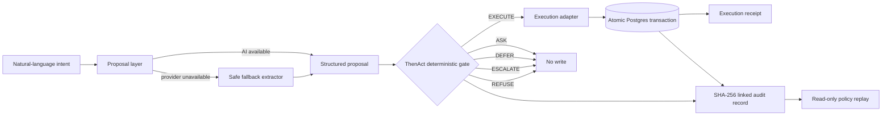

# ThenAct — Architecture Snapshot

**Core principle:** Confidence is evidence. Never authority.

## Decision order

1. Hard policy
2. Evidence freshness
3. Missing information
4. Authority
5. Risk + reversibility
6. Confidence

The proposal layer may interpret intent, but it never grants permission. Only the deterministic gate can authorize execution.

## Enforcement

Only **EXECUTE** creates an execution receipt. The receipt and its audit record are written in one Postgres transaction. All other outcomes prevent the write.

## Audit integrity

Audit records contain inputs, signals, policy trace, reason codes, policy version, enforcement result, previous hash, and SHA-256 record hash. Canonical JSON hashing and hash-graph head detection make verification independent of JSON key order and timestamp ordering.
